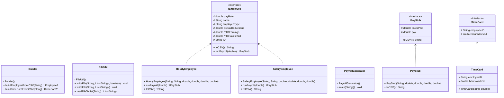
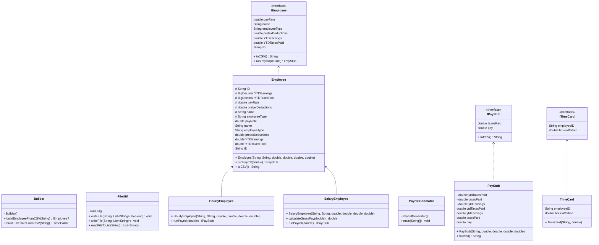

# Payroll Generator Design Document

This document is meant to provide a tool for you to demonstrate the design process. You need to work on this before you code, and after have a finished product. That way you can compare the changes, and changes in design are normal as you work through a project. It is contrary to popular belief, but we are not perfect our first attempt. We need to iterate on our designs to make them better. This document is a tool to help you do that.

## (INITIAL DESIGN): Class Diagram

Place your class diagram below. Make sure you check the fil in the browser on github.com to make sure it is rendering correctly. If it is not, you will need to fix it. As a reminder, here is a link to tools that can help you create a class diagram: [Class Resources: Class Design Tools](https://github.com/CS5004-khoury-lionelle/Resources?tab=readme-ov-file#uml-design-tools)

## (INITIAL DESIGN): Tests to Write - Brainstorm

Write a test (in english) that you can picture for the class diagram you have created. This is the brainstorming stage in the TDD process. 

> [!TIP]
> As a reminder, this is the TDD process we are following:
> 1. Figure out a number of tests by brainstorming (this step)
> 2. Write **one** test
> 3. Write **just enough** code to make that test pass
> 4. Refactor/update  as you go along
> 5. Repeat steps 2-4 until you have all the tests passing/fully built program

You should feel free to number your brainstorm. 

1. Test that the `Employee` class properly returns `name` from `getName()`
2. Test that the `Employee` class properly returns `id` from `getId()`
3. continue to add your brainstorm here (you don't need to super formal - this is a brainstorm) - yes, you can change the bullets above to something that fits your design.
4. Test that the `Employee` class properly returns `rate` from `getPayRate()`
5. Test that the `Employee` class properly returns `employee type` from `getEmployeeType()`
6. Test that the `Employee` class properly returns `YTDEarnings` from `getYTDEarnings()`
7. Test that the `Employee` class properly returns `YTDTaxesPaid` from `getYTDTaxesPaid()`
8. Test that the `Employee` class properly returns `PretaxDeductions` from `getPretaxDeductions()`
9. Test that the `Employee` class properly returns `Payroll` from `runPayroll(double hoursWorked)`
10. Test that the `PayStub` class properly returns `payment` from `getPay()`
11. Test that the `PayStub` class properly returns `tax paid` from `getTaxesPaid()`
12. Test that the `PayStub` class properly returns `HoursWorked` from `getHoursWorked()`
13. Test that the `Timecard` class properly returns `EmployeeID` from `getEmployeeID()`
14. Test that the `Builder` class properly returns `Employee obj` from `buildEmployeeFromCSV(String csv)`
15. est that the `Builder` class properly returns `TimeCard obj` from `buildTimeCardFromCSV(String csv)`

## (FINAL DESIGN): Class Diagram

Go through your completed code, and update your class diagram to reflect the final design. Make sure you check the file in the browser on github.com to make sure it is rendering correctly. It is normal that the two diagrams don't match! Rarely (though possible) is your initial design perfect. 

> [!WARNING]
> If you resubmit your assignment for manual grading, this is a section that often needs updating. You should double check with every resubmit to make sure it is up to date.

## (FINAL DESIGN): Reflection/Retrospective

> [!IMPORTANT]
> The value of reflective writing has been highly researched and documented within computer science, from learning new information to showing higher salaries in the workplace. For this next part, we encourage you to take time, and truly focus on your retrospective.

Take time to reflect on how your design has changed. Write in *prose* (i.e. do not bullet point your answers - it matters in how our brain processes the information). Make sure to include what were some major changes, and why you made them. What did you learn from this process? What would you do differently next time? What was the most challenging part of this process? For most students, it will be a paragraph or two. 
>the biggest thing was realizing how much duplicated code I had in both the SalaryEmployee and HourlyEmployee classes. At first, I had them both implementing the IEmployee interface directly, which means I have to write similar methods like the getters or toCSV over and over again. Then I went to a TA, I learned that I could use an abstract class to store these methods, fields, and constructors. This way, I dont need to write multiple getters and all other things in both hourly and salary employees, this makes my code a lot more clear. I also learned that in an abstract class, I don’t need to define the body of every method. I can just declare methods using the keyword "abstract" if I want subclasses to implement them. The most challenging part was the big decimal part. My original output was off by 0.01, I tried to use string.format but it did not work. I had to go seek for TA's help again.  Next time, I would plan out inheritance and same functionality earlier to avoid rewriting. 